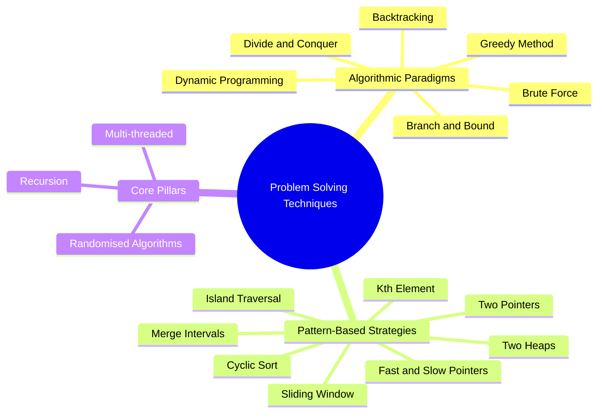

# Problem Solving Techniques

Welcome to the **Problem Solving Techniques** directory! While data structures represent how we store data, problem-solving techniques are the blueprints for how we manipulate that data to solve complex algorithmic challenges.

This guide bridges the gap between **Classic Algorithmic Paradigms** (traditional computer science design strategies) and **Pattern-Based Strategies** (highly practical patterns popular in coding interviews, like LeetCode and Edabit).

---

## Problem Solving Techniques Mindmap

The following classification maps your techniques into two main categories: **Algorithmic Design Paradigms** and **Data Structure Patterns**.

---

## Part 1: Algorithmic Design Paradigms

These are foundational design paradigms that govern how we construct algorithms from a high level.

### 1. Brute Force (Naive Search)
* **Core Idea**: Try all possible solutions until the correct one is found.
* **When to Use**: As a baseline to verify correctness, or when the input size N is extremely small (e.g., N <= 10).
* **Time Complexity**: Typically O(2^N), O(N!), or O(N^K).
* **Practice in Repo**: [subsets.ts](file:///home/junior/Projects/dsa/ds/arrays/problems/subsets.ts) (can be solved via generating all combinations).

### 2. Backtracking
* **Core Idea**: An incremental search algorithm that builds candidates to a solution and **backtracks** (abandons a path) as soon as it determines that the path cannot lead to a valid solution.
* **When to Use**: Combination, permutation, grid search with state-restoration, and constraint-satisfaction problems.
* **Time Complexity**: O(K^N) where K is the number of choices at each decision point.
* **Practice in Repo**:
  * [sudoku-solver.ts](file:///home/junior/Projects/dsa/ds/arrays/problems/sudoku-solver.ts) (classic constraint propagation + backtracking)
  * [combination-sum.ts](file:///home/junior/Projects/dsa/ds/arrays/problems/combination-sum.ts)
  * [subsets.ts](file:///home/junior/Projects/dsa/ds/arrays/problems/subsets.ts)

### 3. Greedy Method
* **Core Idea**: Make the locally optimal choice at each step with the hope that these local choices lead to a globally optimal solution.
* **When to Use**: Problems with the greedy choice property (a local optimum is part of a global optimum) and optimal substructure.
* **Time Complexity**: Typically O(N log N) (due to sorting) or O(N).
* **Practice in Repo**:
  * [jump-game.ts](file:///home/junior/Projects/dsa/ds/arrays/problems/jump-game.ts)
  * [jump-game-ii.ts](file:///home/junior/Projects/dsa/ds/arrays/problems/jump-game-ii.ts)

### 4. Dynamic Programming (DP)
* **Core Idea**: Solve complex problems by breaking them down into simpler, overlapping subproblems. Compute each subproblem once and store the result (via Memoization/Top-down or Tabulation/Bottom-up).
* **When to Use**: Problems with **overlapping subproblems** and **optimal substructure**.
* **Time Complexity**: Typically O(N * M) or O(N) instead of exponential time.
* **Practice in Repo**:
  * [minimum-path-sum.ts](file:///home/junior/Projects/dsa/ds/arrays/problems/minimum-path-sum.ts)
  * [unique-paths-ii.ts](file:///home/junior/Projects/dsa/ds/arrays/problems/unique-paths-ii.ts)
  * [maximal-rectangle.ts](file:///home/junior/Projects/dsa/ds/arrays/problems/maximal-rectangle.ts)

### 5. Branch and Bound
* **Core Idea**: Used exclusively for optimization problems. It keeps track of the best solution found so far (a bound) and prunes state space tree branches that cannot possibly yield a better solution.
* **When to Use**: Hard optimization problems like the Travelling Salesperson Problem (TSP) or 0/1 Knapsack when input size is small-medium.
* **Time Complexity**: Worst case O(2^N), but average case is much faster due to bounding and pruning.

### 6. Divide and Conquer
* **Core Idea**: Divide the problem into smaller, independent subproblems of the same type, solve them recursively, and then combine their results.
* **When to Use**: When a problem can be partitioned into non-overlapping subproblems (e.g., sorting, searching).
* **Practice in Repo**:
  * [count-inversions.ts](file:///home/junior/Projects/dsa/ds/binary-indexed-trees/problems/count-inversions.ts) (Merge-sort based or BIT-based)
  * [search-a-2d-matrix.ts](file:///home/junior/Projects/dsa/ds/arrays/problems/search-a-2d-matrix.ts) (Binary search variant)

---

## Part 2: Pattern-Based Interview Strategies

These are data structure-specific patterns that convert brute-force solutions into elegant, linear or logarithmic time algorithms.

### 1. Sliding Window
* **Core Idea**: Maintain a sub-segment (window) of a linear data structure and slide it to avoid redundant calculations.
* **When to Use**: Problems asking for subarrays, substrings, or contiguous sequences satisfying a condition (e.g., maximum sum, shortest length).
  * **Fixed Window**: Slide window of size K by adding element at R and removing element at L.
  * **Variable Window**: Expand R, and shrink from L when the condition is violated.
* **Time Complexity**: O(N) (each element is visited at most twice).
* **Practice in Repo**:
  * [sliding-window-maximum.ts](file:///home/junior/Projects/dsa/ds/queues/problems/sliding-window-maximum.ts)

### 2. Two Pointer Technique
* **Core Idea**: Use two pointers to traverse a linear data structure (usually sorted) from different directions or speeds to solve a problem with reduced time or space.
* **When to Use**: Sorted arrays/lists looking for pairs, reversals, or element comparison.
  * **Opposite ends**: Pointer 1 starts at index 0, Pointer 2 starts at n-1. Move inwards.
  * **Same direction (Fast/Slow)**: Pointers start at the same end; one processes elements while the other keeps track of write-position.
* **Time Complexity**: O(N) or O(N log N) if sorting is required.
* **Practice in Repo**:
  * [two-sum.ts](file:///home/junior/Projects/dsa/ds/arrays/problems/two-sum.ts) (Two-pointer when sorted, or Hash Map)
  * [container-with-most-water.ts](file:///home/junior/Projects/dsa/ds/arrays/problems/container-with-most-water.ts)
  * [trapping-rain-water.ts](file:///home/junior/Projects/dsa/ds/arrays/problems/trapping-rain-water.ts)
  * [three-sum.ts](file:///home/junior/Projects/dsa/ds/arrays/problems/three-sum.ts)
  * [sort-colors.ts](file:///home/junior/Projects/dsa/ds/arrays/problems/sort-colors.ts)

### 3. Fast and Slow Pointers (Tortoise and Hare)
* **Core Idea**: Use two pointers moving at different speeds (usually one at 1x speed and the other at 2x speed).
* **When to Use**: Detecting cycles in linked lists, arrays, or directed graphs, or finding the midpoint of a list.
* **Time Complexity**: O(N) space: O(1).
* **Practice in Repo**:
  * [detect-cycle.ts](file:///home/junior/Projects/dsa/ds/linked-lists/problems/detect-cycle.ts)
  * [happy-number.ts](file:///home/junior/Projects/dsa/ds/hash-tables/problems/happy-number.ts)

### 4. Merge Intervals
* **Core Idea**: Sort intervals by their start times, then iterate and merge overlapping intervals.
* **When to Use**: Dealing with overlapping time ranges, schedules, or intervals.
* **Time Complexity**: O(N log N) (due to sorting).
* **Practice in Repo**:
  * [merge-intervals.ts](file:///home/junior/Projects/dsa/ds/arrays/problems/merge-intervals.ts)
  * [insert-interval.ts](file:///home/junior/Projects/dsa/ds/arrays/problems/insert-interval.ts)

### 5. Cyclic Sort
* **Core Idea**: If numbers in an array are in the range [1, N] or [0, N], we can sort the array in O(N) time by swapping each number to its correct index (i.e. number x at index x - 1) in O(n) time and O(1) space.
* **When to Use**: Finding missing, duplicate, or incorrect numbers in a given range.
* **Time & Space**: O(N) time, O(1) auxiliary space.
* **Practice in Repo**:
  * [first-missing-positive.ts](file:///home/junior/Projects/dsa/ds/arrays/problems/first-missing-positive.ts)

### 6. Two Heaps
* **Core Idea**: Divide elements into two parts: a **Max-Heap** to store the smaller half, and a **Min-Heap** to store the larger half.
* **When to Use**: When you need to maintain the median of a stream of numbers, or dynamically partition elements into smaller/larger segments.
* **Time Complexity**: O(log N) insertion, O(1) query.
* **Practice in Repo**:
  * [find-median-from-data-stream.ts](file:///home/junior/Projects/dsa/ds/heaps/problems/find-median-from-data-stream.ts)

### 7. Island Traversal (Graph DFS/BFS)
* **Core Idea**: Traverse a multi-dimensional grid (matrix) using standard Graph DFS/BFS, marking visited coordinates to prevent cycles.
* **When to Use**: Matrix-based search where cells represent land, water, or obstacles.
* **Time Complexity**: O(R * C) where R and C are rows and columns.
* **Practice in Repo**:
  * [number-of-islands.ts](file:///home/junior/Projects/dsa/ds/graphs/problems/number-of-islands.ts)
  * [pacific-atlantic-water-flow.ts](file:///home/junior/Projects/dsa/ds/graphs/problems/pacific-atlantic-water-flow.ts)

### 8. Kth Element (Quickselect / Heap-based)
* **Core Idea**: Finding the k-th smallest or largest element without fully sorting the array.
  * **Heap approach**: Use a min-heap or max-heap of size K. Time: O(N log K).
  * **Quickselect**: Partition the array recursively using a pivot (like Quicksort). Average time: O(N).
* **Practice in Repo**:
  * [kth-largest-element-in-an-array.ts](file:///home/junior/Projects/dsa/ds/heaps/problems/kth-largest-element-in-an-array.ts)
  * [top-k-frequent-elements.ts](file:///home/junior/Projects/dsa/ds/heaps/problems/top-k-frequent-elements.ts)
  * [k-closest-points-to-origin.ts](file:///home/junior/Projects/dsa/ds/heaps/problems/k-closest-points-to-origin.ts)

---

## Coverage Status for /solutions

The `solutions/` section now covers all major techniques listed in this guide.

### Algorithmic Paradigms
1. `brute-force`
2. `back-tracking`
3. `greed-method`
4. `branch-and-bond`
5. `divide-and-conquer`
6. `dynamic-programming`
7. `randomised-algorithms`

### Pattern-Based Strategies
1. `sliding-window`
2. `two-pointers`
3. `fast-slow-pointers`
4. `merge-intervals`
5. `cyclic-sort`
6. `two-heaps`
7. `island-traversal`
8. `kth-element`

### Core Pillars
1. `recursion`
2. `multi-threaded`
